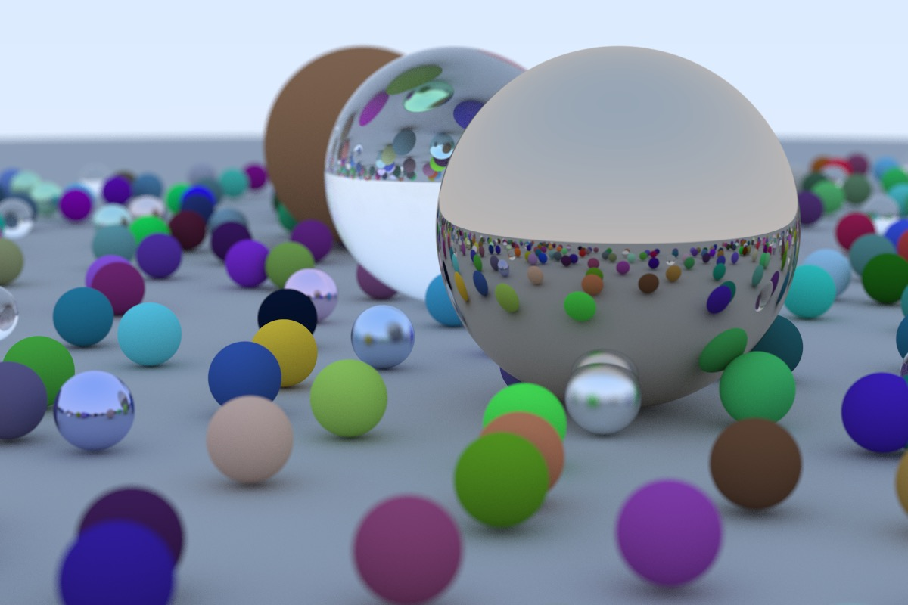

# raytracing_in_one_weekend_rust
My implementation of [_Ray Tracing in One Weekend_](https://raytracing.github.io/books/RayTracingInOneWeekend.html) book in Rust



## Run
```
cargo run --release > out.ppm
```
